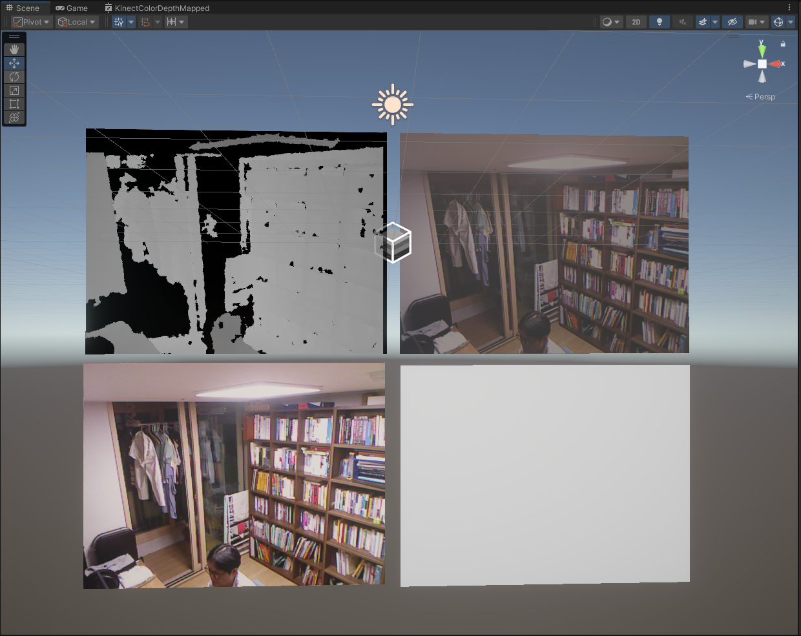

# KinectUnity
## What is Kinect?
 - https://en.wikipedia.org/wiki/Kinect

## Kinect SDK Download
 - [Kinect for Windows SDK](https://www.microsoft.com/en-US/download/details.aspx?id=36996)
 - [Kinect for Windows Developer Toolkit](https://www.microsoft.com/en-US/download/details.aspx?id=36998)

## KinectUnity
 - This project is for integrating between Kinect and Unity.
 - We can pass color, depth, IR data from Kinect to Unity.
 - Currently this project provides Windows/DLL ONLY for Kinect V1.
 - 
 - 
